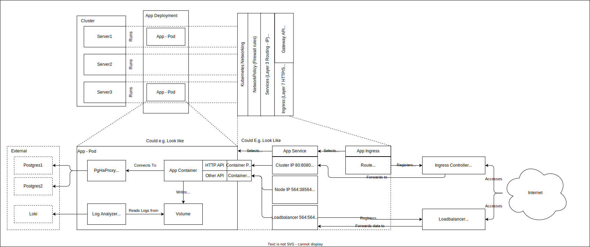

# Kubernetes Nomenclature

Kubernetes, often abbreviated as K8s, has its own unique terminology. Understanding this nomenclature is crucial for working with Kubernetes effectively. Here's a breakdown of key terms:

## Core Concepts - Hardware Abstraction

- **Cluster**: A set of nodes (servers) for running containerized applications. It's the foundation of Kubernetes.
- **Node**: A worker machine in Kubernetes, part of a cluster. Can be a physical or virtual machine.

## Core Concepts - Application Abstraction

- **[Container](https://kubernetes.io/docs/concepts/containers/)**: Can be seen as a super lightweight VM which contains an application.
- **[Pod](https://kubernetes.io/docs/concepts/workloads/pods/)**: The smallest deployable unit in K8. It can contain one or more containers with shared storage and network resources. A pod is always on one node
- **[WorkLoad](https://kubernetes.io/docs/concepts/workloads/controllers/)**:  A workload is an application running on Kubernetes, it can be scaled, updated, etc. There are multiple differnt kinds of workloads:
  - **Deployment**: A Stateless Workload (e.g. Ngnix serving a webpage)
  - **StatefulSet**: A Stateful Workload (e.g. a Database)
  - **Daemon Sets**: Something running on the Node - e.g. a Metrics Collector
  - **Job/CronJob**: A One off or scheduled Task 

## Core Concepts - Network Abstraction

- **Network Policy**: Network Rules, Kinda like a Cluster IPTables
- **Service (Layer3)**: Layer 3 Networking rules - assings internal or external IPs to Pods. Can also support Layer7 routing
- **Ingress (Layer7)**: Connects Services to the Outside world through HTTP/S (can also support Layer3), uses ingress Controller which are addons to a Kubernetes cluster.

## Core Concepts - Resource Organization

- **Namespace**: A virtual cluster within a physical Kubernetes cluster. Can contain most other resources avaiable. Useful for Oranizing, creating Resource restrictions, access restrictions etc.

## Core Concepts - Graph

## Configuration and Storage

- **ConfigMap**: An API object used to store non-confidential data in key-value pairs.

- **Secret**: Similar to ConfigMap but for confidential data, stored in base64 encoding.

- **Volume**: A directory containing data, accessible to the containers in a pod.

- **PersistentVolume (PV)**: A piece of storage in the cluster provisioned by an administrator or dynamically.

- **PersistentVolumeClaim (PVC)**: A request for storage by a user, which can be fulfilled by a PV.

## Metadata and Organization

- **Namespace**: A way to divide cluster resources between multiple users, teams, or projects.

- **Label**: Key-value pairs attached to objects for identification and organization.

- **Annotation**: Similar to labels, but for non-identifying metadata.

## Control and Management

- **Controller**: A control loop that watches the shared state of the cluster and makes changes to move the current state towards the desired state.

- **Operator**: A method of packaging, deploying, and managing a Kubernetes application using custom resources and controllers.

- **Kubectl**: The command-line tool for interacting with the Kubernetes API.

- **Kubeconfig**: A file used to configure access to Kubernetes clusters.

Understanding these terms will provide a solid foundation for working with Kubernetes and communicating effectively about its components and operations.

