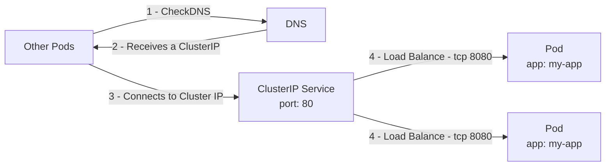
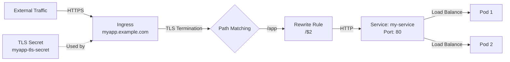
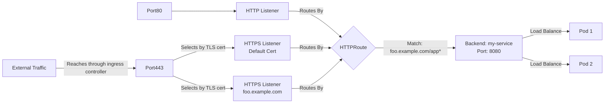

# Kubernetes Networking Components

## Service

- Provides a stable network endpoint for a set of Pods
- Operates at Layer 4 (TCP/UDP)
- Types: ClusterIP, NodePort, LoadBalancer, ExternalName

### Service Types

1. ClusterIP:
   - Default type
   - **Only** reachable from **within** the cluster
   - Exposes the Service on a cluster-internal IP & DNS
   - Useful for internal communication between services
   - DNS format: <service-name>.<namespace>.svc.cluster.local
   - Does not map to an external DNS name

2. NodePort:
   - Usually used for Dev setups
   - **Accessible** from **outside** the cluster using <NodeIP>:<NodePort>
   - Exposes the Service on each Node's IP at a static port
   - Automatically creates a ClusterIP Service
   - Port range: 30000-32767 by default

3. LoadBalancer:
   - **Requires an external Load Balancer** to be **installed** or Cloud Provider Support
   - Exposes the Service externally using a load balancer
   - Automatically creates NodePort and ClusterIP Services
   - Assigns an external IP to the Service

4. ExternalName:
   - Maps the Service to a DNS name Internally
   - Returns a CNAME record with the specified external DNS name
   - No proxying or port mapping
   - Useful for integrating external services into the cluster

## Ingress

More advanced Layer7 (HTTP/S) routing on top o a sercice

- **Requires an Ingress Controller** to be **installed** on the Cluster
- Manages external access to Services in a cluster
- Operates at Layer 7 (HTTP)
- Provides HTTP/HTTPS routing
- Can provide SSL termination, name-based virtual hosting, and more

## Gateway API

- **Requires an Gateway controller** to be **installed** on the cluster
- Manages external access to Services in a cluster
- Operates at Layer 3/7
- Provides HTTP/HTTPS routing
- More extensive feature set than Ingress - better support for TCP/UDP

## Network Policy

- Defines how groups of Pods are allowed to communicate with each other and other network endpoints
- Acts as a firewall for Pods
- Can restrict traffic based on namespaces, labels, IP blocks, and ports
- Is namespace-scoped

## Comparison

| Feature              | Service                     | Ingress                     | Gateway API                | Network Policy            |
|----------------------|-----------------------------|-----------------------------|----------------------------|---------------------------|
| Primary Function     | Expose Pods                 | Route external HTTP traffic | Advanced traffic routing   | Control Pod communication |
| Protocol             | Any (typically TCP/UDP)     | HTTP/HTTPS                  | HTTP/HTTPS, TCP, UDP, TLS  | Any                       |
| Layer                | 4                           | 7                           | 4-7                        | 3-4                       |
| Scope                | Cluster-wide                | Cluster-wide                | Cluster-wide               | Namespace                 |
| Load Balancing       | Yes                         | Yes (via Service)           | Yes                        | No                        |
| External Traffic     | Can expose (LoadBalancer)   | Primary purpose             | Primary purpose            | No direct effect          |
| Internal Traffic     | Primary purpose             | Can be used                 | Supports internal routing  | Primary purpose           |
| Flexibility          | Limited                     | Moderate                    | High                       | High                      |
| Multi-cluster        | No                          | Limited                     | Yes                        | No                        |
| Header-based Routing | No                          | Limited                     | Yes                        | N/A                       |

## Examples

### Example: Service

1. Cluster IP service

```yaml
apiVersion: v1
kind: Service
metadata:
  name: my-clusterip-service
spec:
  selector:
    app: my-app
  ports:
    - protocol: TCP
      port: 80
      targetPort: 8080
```

1. Selects all pods where app = my-app
2. Expose their port 8080 internally in the cluster over port 80, assinging some internal IP
3. Map that IP to DNS names:
   1. my-clusterip-service.\<namespace\>.svc.cluster.internal
   2. my-clusterip-service.\<namespace\>.svc
   3. my-clusterip-service.\<namespace\>
   4. my-clusterip-service

----



----

### Example: Ingress

```yaml
apiVersion: networking.k8s.io/v1
kind: Ingress
metadata:
  name: my-ingress
  annotations:
    nginx.ingress.kubernetes.io/rewrite-target: /$2
spec:
  tls:
  - hosts:
      - myapp.example.com
    secretName: myapp-tls-secret
  rules:
  - host: myapp.example.com
    http:
      paths:
      - path: /app(/|$)(.*)
        pathType: Prefix
        backend:
          service:
            name: my-service
            port: 
              number: 80
```

1. Select the service "my-service" on port 80 as target
2. Sets up a routing rule rule for the host "myapp.example.com"
   1. A path that matches the reges `/app(/|$)(.*)`
   2. Will be rewritten to /$2 - So e.g. /app/hello -> /hello
   3. And will be forwarded to the service on port 80 using http
3. Sets up tls for the given host using the given tls secret (which needs to be created seperately)

----



----

### Example: Gateway API

```yml

## Setting up the Gateway listener https://gateway-api.sigs.k8s.io/guides/tls/
apiVersion: gateway.networking.k8s.io/v1
kind: Gateway
metadata:
  name: example-gateway
spec:
  gatewayClassName: example-gateway-class
  listeners:
  # Allow Http
  - name: http
    protocol: HTTP
    port: 80
  # Allow HTTPS using a default cert
  - name: https
    protocol: HTTPS
    port: 443
    tls:
      mode: Terminate
      certificateRefs:
      - kind: Secret
        name: myapp-tls-default-cert
        group: ""
  # Or a specific cert for a specific hostname
  - name: foo-https
    protocol: HTTPS
    port: 443
    hostname: foo.example.com
    tls:
    certificateRefs:
    - kind: Secret
        group: ""
        name: foo-example-com-cert
  # Wildcards for hostnames are also supported

---
apiVersion: gateway.networking.k8s.io/v1
kind: HTTPRoute
metadata:
  name: example-http-route
spec:
  parentRefs:
  - name: example-gateway
  hostnames: 
  - "foo.example.com"
  rules:
  - matches:
    - path:
        type: PathPrefix
        value: /app
    backendRefs:
      - name: my-service
        port: 8080

# Alternative rout types are - TLSRoute, RCPRoute, HTTPRoute, GRPCRoute
```

1. Create the Gateway:
   1. Which will listen to 80 using HTTP
   2. As well as 443 using HTTPs
      1. Serving two different certificates
2. Create a Routing Rule:
   1. Which will forward everything which matches foo.example.com/app.*
   2. To the `my-service` service

----


<spoiler/>

----


### Example: Network Policy

```yml
apiVersion: networking.k8s.io/v1
kind: NetworkPolicy
metadata:
  name: allow-frontend-to-backend
spec:
  podSelector:
    matchLabels:
      app: backend
  policyTypes:
  - Ingress
  ingress:
  - from:
    - podSelector:
        matchLabels:
          app: frontend
    ports:
    - protocol: TCP
      port: 8080
```

1. Select all pods where app = backend
2. For incomming traffic (ingress)
   1. Allow traffic coming from pods where app = frontend
      1. If port is 8080

